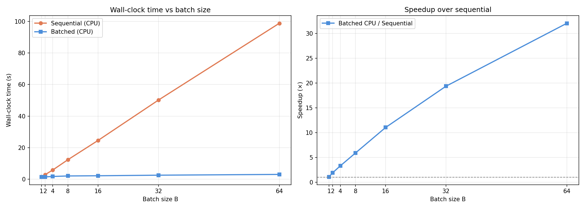
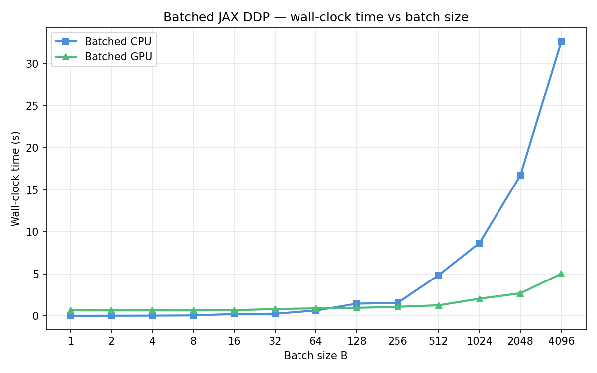

# torchDDP

A PyTorch-based differentiable dynamic programming implementation. It solves batched problems on GPUs.

PyTorch Benchmark on AMD Ryzen 9 9950X batched vs unbatched:

JAX Benchmark on NVIDIA GeForce RTX 4060 and Intel Core i9-14900HX batched CPU vs batched GPU:

